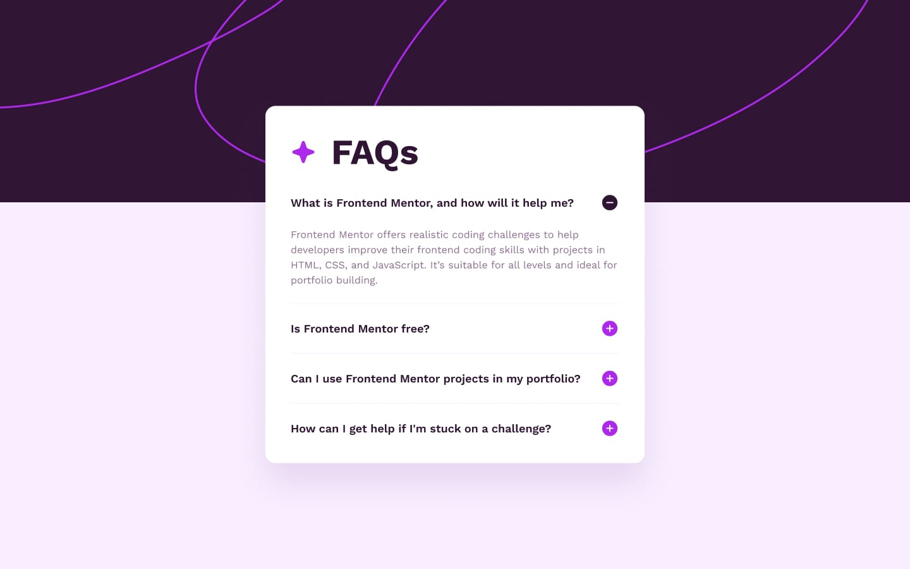

# Frontend Mentor - FAQ accordion solution

This is a solution to the [FAQ accordion challenge on Frontend Mentor](https://www.frontendmentor.io/challenges/faq-accordion-wyfFdeBwBz).

## Overview

### The challenge

Users should be able to:

- Hide/Show the answer to a question when the question is clicked
- Navigate the questions and hide/show answers using keyboard navigation alone
- View the optimal layout for the interface depending on their device's screen size
- See hover and focus states for all interactive elements on the page

### Screenshot

### Links

- Solution URL: [Click Here](https://www.frontendmentor.io/solutions/faqaccordian-vvuojZgjX7)
- Live Site URL: [Click Here](https://karthikyerra1.github.io/faq-accordian/)

## My process

### Built with

- Semantic HTML5 markup
- CSS custom properties
- Flexbox
- Mobile-first workflow
- JavaScript

## Author

- Website - [Karthik Yerra]
- Frontend Mentor - [@KarthikYerra1](https://www.frontendmentor.io/profile/KarthikYerra1)
